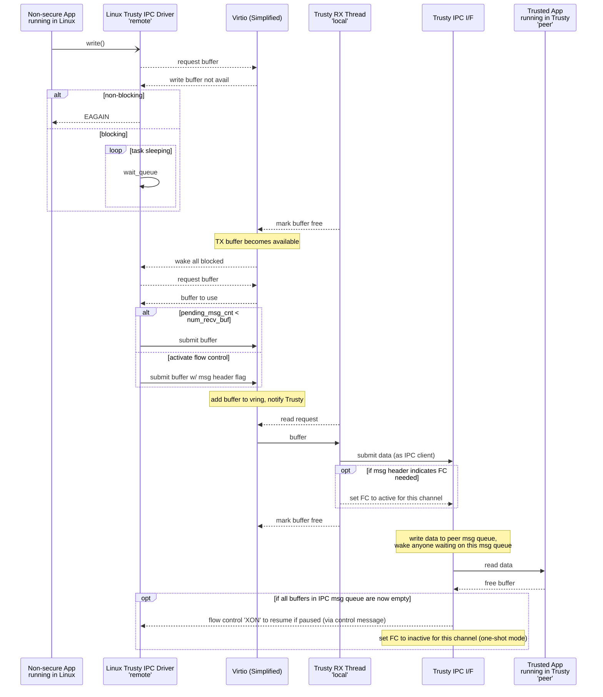

```mermaid
sequenceDiagram
    participant NS as Non-secure App<br/>running in Linux
    participant LD as Linux Trusty IPC Driver<br/>'remote'
    participant V as Virtio (Simplified)
    participant RX as Trusty RX Thread<br/>'local'
    participant IPC as Trusty IPC I/F
    participant TA as Trusted App<br/>running in Trusty<br/>'peer'
    NS-)LD: write()
    LD-->>V: request buffer
    V-->>LD: write buffer not avail
    alt non-blocking
        LD-->>NS: EAGAIN
    else blocking
        loop task sleeping
            LD->>LD: wait_queue
        end
    end
    RX-->>V: mark buffer free
    Note over V: TX buffer becomes available
    V-->>LD: wake all blocked
    LD-->>V: request buffer
    V-->>LD: buffer to use
    alt pending_msg_cnt < num_recv_buf
        LD->>V: submit buffer
    else activate flow control
        LD->>V: submit buffer w/ msg header flag
    end
    Note over V: add buffer to vring, notify Trusty
    RX-->>V: read request
    V->>RX: buffer
    RX->>IPC: submit data (as IPC client)
    opt if msg header indicates FC needed
        RX-->>IPC: set FC to active for this channel
    end
    RX-->>V: mark buffer free
    Note over IPC: write data to peer msg queue,<br/>wake anyone waiting on this msg queue
    IPC->>TA: read data
    TA-->>IPC: free buffer
    opt if all buffers in IPC msg queue are now empty
        IPC-->>LD: flow control 'XON' to resume if paused (via control message)
        Note over IPC: set FC to inactive for this channel (one-shot mode)
    end

```
